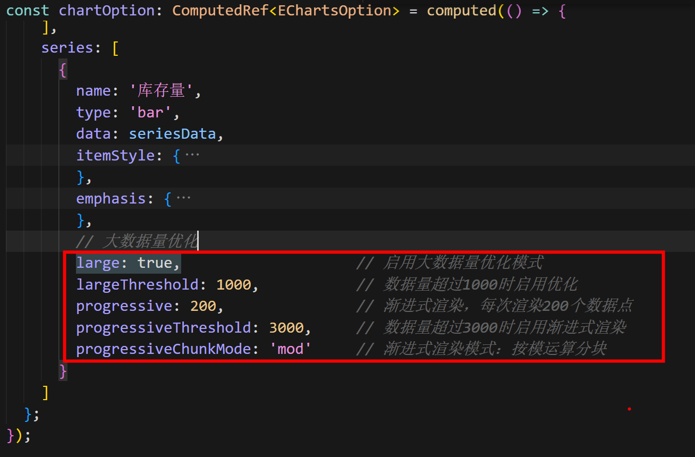
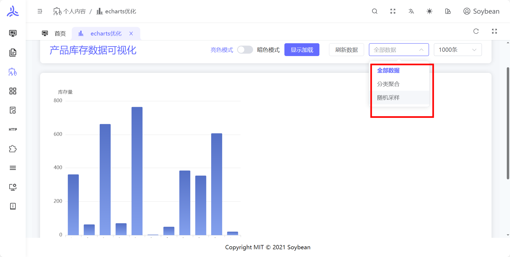
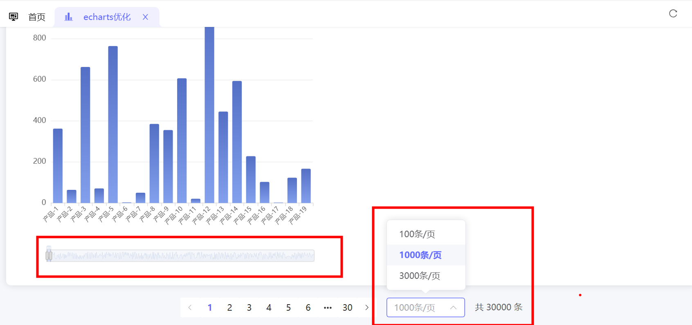

# ECharts 性能优化

http://47.103.169.121:8083/personal-content/echarts-optimization

## 场景

当 echarts 数据量过大时，导致渲染卡顿

## 解决方案及效果展示

### 1. ECharts 内置大数据优化配置

### 2. 数据采样策略（Sampled Mode）， 数据聚合策略（Aggregated Mode）

### 3. DataZoom 数据缩放 ，分页加载数据

