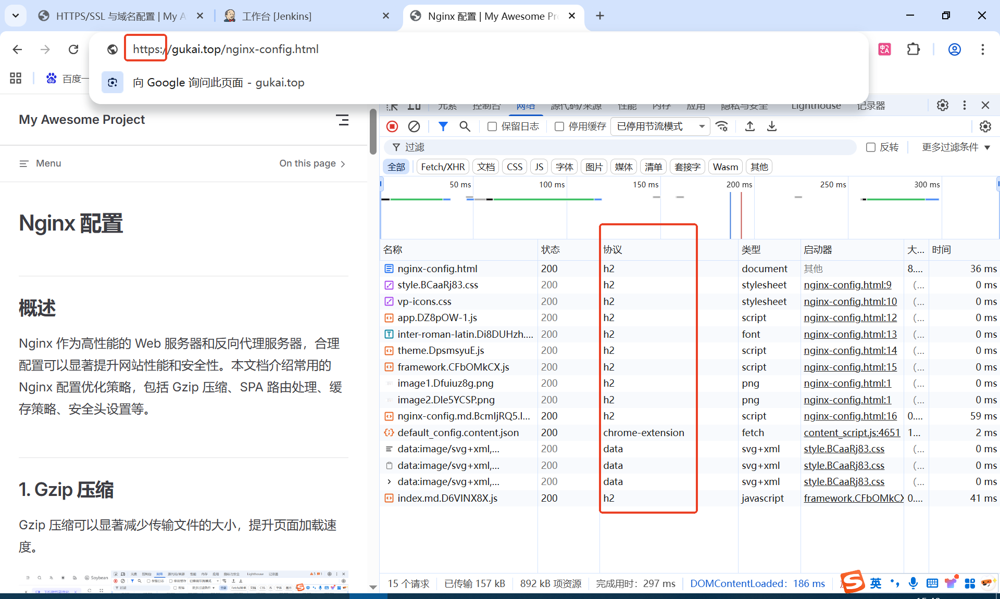

# HTTPS/SSL 与域名配置

## 概述

HTTPS（HyperText Transfer Protocol Secure）是 HTTP 的安全版本，通过 SSL/TLS 协议对传输的数据进行加密，确保数据在传输过程中的安全性和完整性。

## 1.示例

[gukai.top](https://gukai.top)

## 2.实现步骤

1. 阿里云申请域名,解析到自己的 ip 地址
2. 阿里云申请免费 SSL 证书，下载对应的 nginx 类型 pem/key
3. jenkins 配置 pem/key 文件凭证
4. jenkinfile,dockerfile,nginx.conf 配置相关 ssl 逻辑

## 3.结果展示

