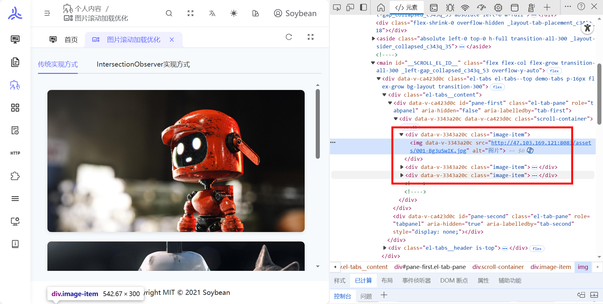
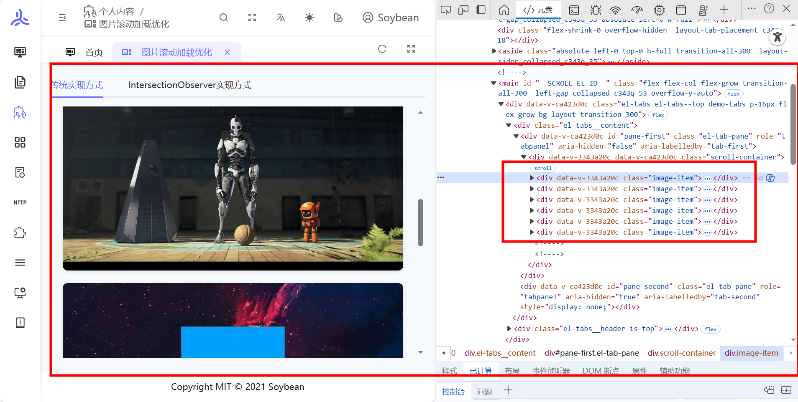
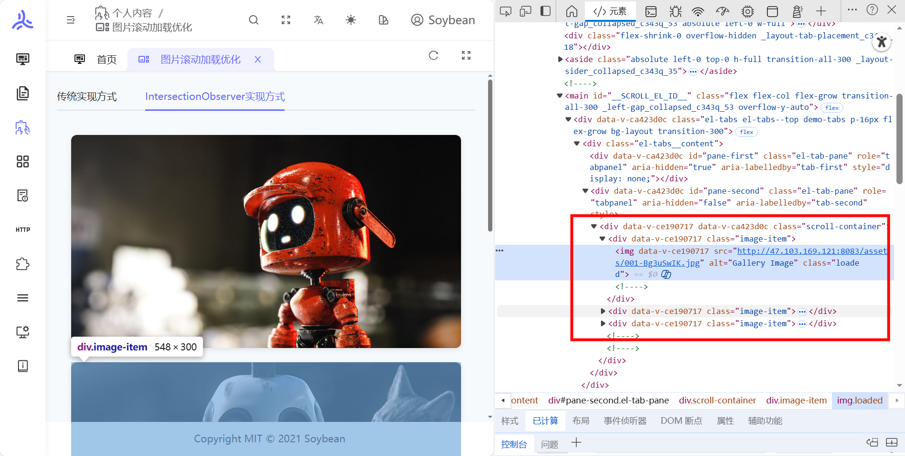
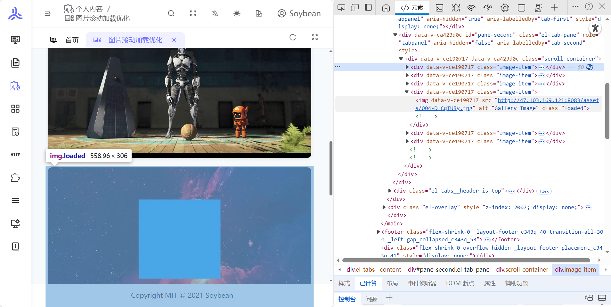
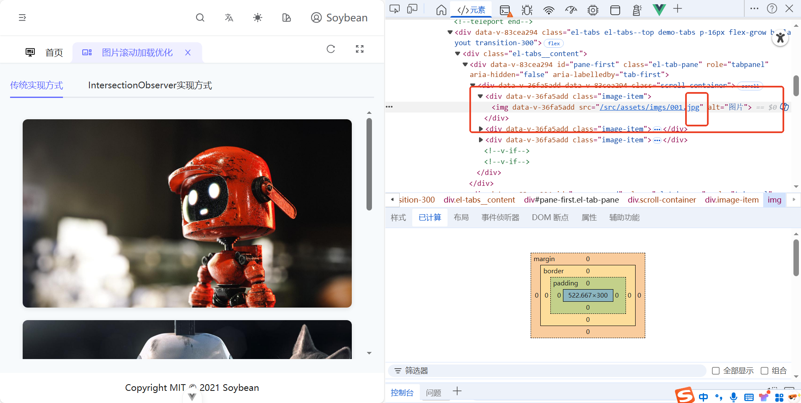
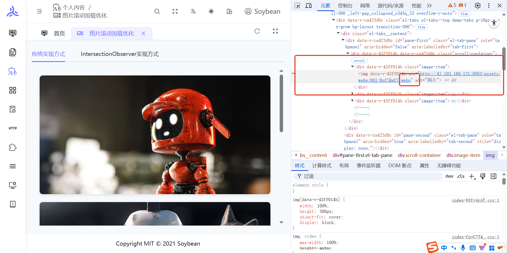

# 图片加载性能优化

http://47.103.169.121:8083/personal-content/image-loading-optimization

## 场景一

当一次性加载渲染所有图片导致页面卡顿性能问题

## 解决方案

按需渲染，一次性只加载部分图片

## 传统实现方式效果展示

## IntersectionObserver 实现方式效果展示

## 场景二

项目中的 JPG 图片体积较大，导致加载慢、占用带宽多，影响首屏性能。

## 解决方案

在构建阶段通过 Vite 插件 `vite-plugin-imagemin` 将项目内的 JPG 图片压缩并转换为 WebP 格式，在保证画质的前提下减小体积、加快加载。

