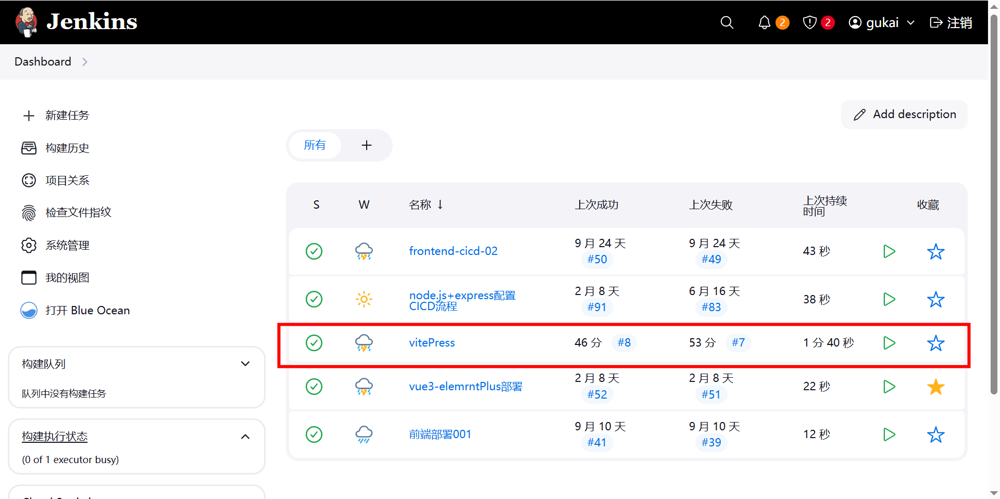
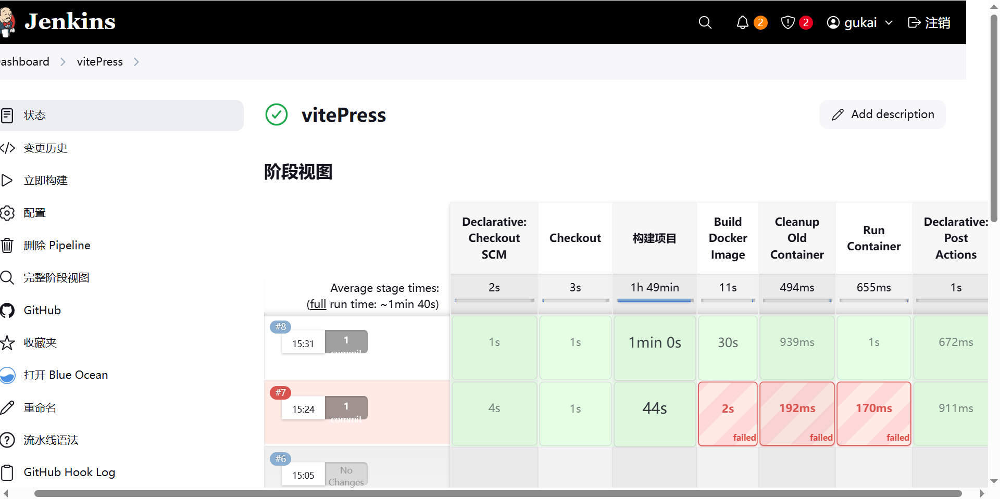

# Jenkins CI/CD 实现

## 概述

本项目使用 Jenkins 实现 VitePress 文档站点的自动化 CI/CD 部署流程。当代码推送到远程仓库后，Jenkins 会自动触发构建、打包、Docker 镜像构建和容器部署，实现一键自动化部署。

## 技术栈

- **构建工具**: VitePress 2.0.0-alpha.15
- **包管理器**: pnpm
- **容器化**: Docker
- **Web 服务器**: Nginx (Alpine)
- **CI/CD 平台**: Jenkins

## 部署流程

### 1. 代码检出 (Checkout)

- 从 GitHub 仓库 `***/vitePress` 的 `main` 分支拉取最新代码

### 2. 项目构建 (构建项目)

- 使用 Node.js 23.8.0 环境
- 配置 pnpm 镜像源（使用国内镜像加速）
- 安装项目依赖
- 执行 `pnpm run docs:build` 构建 VitePress 静态文件
- 构建产物输出到 `docs/.vitepress/dist` 目录

### 3. Docker 镜像构建 (Build Docker Image)

- 使用 Dockerfile 构建 Docker 镜像
- 镜像名称: `vitepress`
- 将构建产物和 Nginx 配置打包到镜像中

### 4. 容器部署 (Run Container)

- 停止并删除旧容器（如果存在）
- 启动新容器，映射端口 `8085:80`
- 容器名称: `vitepress-container`

### 5. 清理 (Post Actions)

- 清理未使用的 Docker 镜像和资源

## 访问地址

部署完成后，可通过以下地址访问：

```
http://47.103.169.121:8085/
```

## 配置文件说明


### Jenkinsfile

定义了完整的 CI/CD 流水线，包括代码检出、构建、Docker 镜像构建和容器部署等步骤。

### Dockerfile

基于 Nginx Alpine 镜像，将 VitePress 构建产物复制到容器中，配置 Nginx 服务。

### nginx.conf

Nginx 配置文件，包含：

- SPA 路由支持（`try_files` 配置）
- Gzip 压缩优化
- 静态资源缓存策略
- 安全头设置

## 场景说明

**场景**: 提交代码到远程仓库，自动部署

当开发者将代码推送到 GitHub 仓库的 `main` 分支后：
github 通过配置的 web-hook 通知 jenkins,Jenkins 检测到代码变更后，通过 github 凭证拉取最新代码

1. Jenkins 自动检测到代码变更
2. 触发构建流水线
3. 自动完成构建、打包、部署全流程
4. 无需手动操作，实现真正的自动化部署



