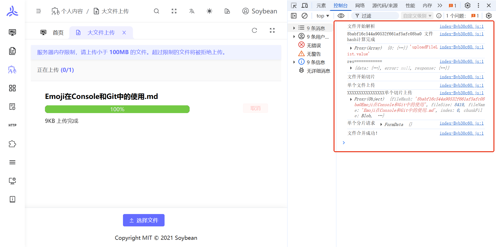
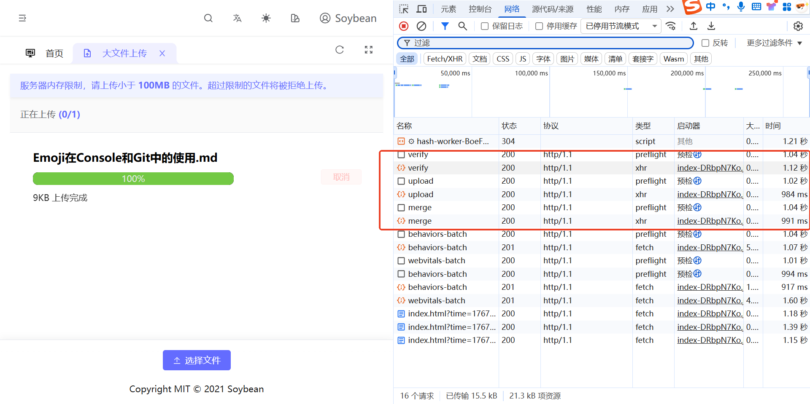
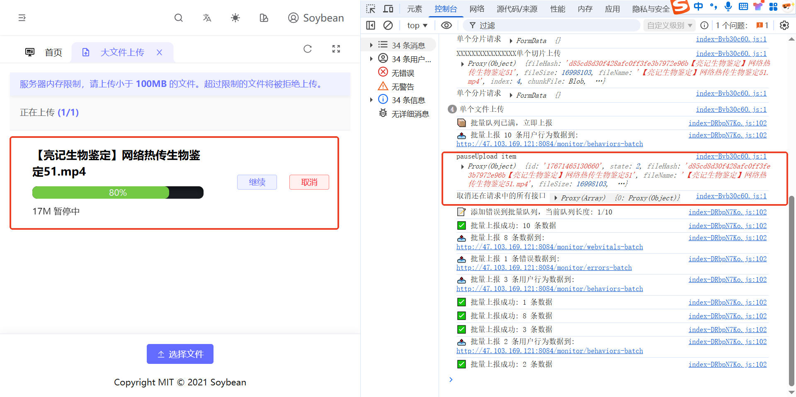
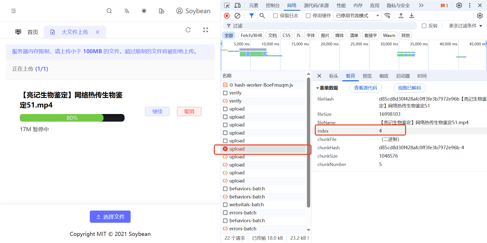
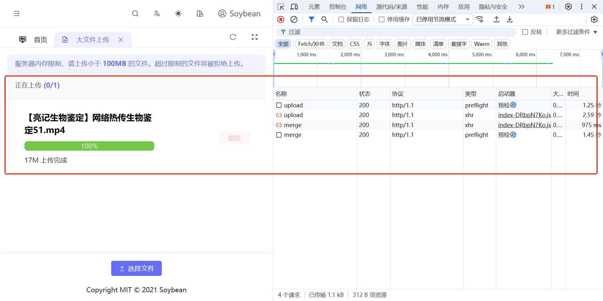

# 大文件上传功能与优化手段

::: tip
由于服务器内存大小原因，上传的文件大小被限制最大为 100M，超过 100M 自动清除所有内容，可自行上传文件，在控制台查看关键上传信息和处理流程
:::

http://47.103.169.121:8083/personal-content/large-file-upload

### 一、核心功能

#### 1. 文件分片上传

```typescript
// 切片大小：1MB
const chunkSize = 1 * 1024 * 1024;
```

- 将大文件切分为 1MB 的块
- 分片独立上传，降低单次请求压力

#### 2. 文件 Hash 计算（Web Worker）

```typescript
const useWorker = (file: File): Promise<WorkerResult> => {
  const worker = new Worker(
    new URL("@/worker/hash-worker.js", import.meta.url)
  );
  worker.postMessage({ file, chunkSize });
  // 使用 SparkMD5 计算文件 MD5
};
```



- 在 Web Worker 中计算 MD5，不阻塞主线程
- 支持进度反馈

#### 3. 秒传功能

```typescript
const res = await checkFile({ fileHash, fileName });
if (!shouldUpload) {
  finishTask(inTaskArrItem); // 文件已存在，直接完成
}
```

第一次上传



刷新页面，第二次上传


- 上传前检查文件是否存在
- 存在则直接完成，无需上传

#### 4. 断点续传

```typescript
// 过滤掉已经上传过的切片
inTaskArrItem.allChunkList = inTaskArrItem.allChunkList.filter(
  (chunk) => !uploadedList.includes(chunk.chunkHash)
);
```

暂停上传




继续上传



- 检查已上传的切片
- 仅上传缺失的切片

#### 5. 暂停/继续上传

```typescript
// 暂停：取消所有进行中的请求
pauseUpload(taskArrItem, true); // state = 3

// 继续：恢复上传
resumeUpload(taskArrItem); // state = 2
```

- 可暂停和恢复
- 暂停时取消进行中的请求

#### 6. 取消上传

```typescript
// 取消单个文件
cancelSingle(taskArrItem);

// 取消所有文件
cancelAll();
```

- 支持单个或全部取消
- 取消时清理请求和状态

#### 7. 多文件并发上传

```typescript
Array.from(files).forEach(async (item, i) => {
  // 每个文件独立处理
});
```

- 支持同时上传多个文件
- 每个文件独立管理状态

#### 8. 动态并发控制

```typescript
// 实时动态获取并发请求数
const isTaskArrIng = uploadFileList.value.filter(
  (item) => item.state === 1 || item.state === 2
);
maxRequest.value = Math.ceil(6 / isTaskArrIng.length);
```

- 根据同时上传的文件数动态调整每个文件的并发数
- 总并发不超过 6（浏览器限制）

#### 9. 错误重试机制

```typescript
if (taskArrItem.errNumber > 3) {
  pauseUpload(taskArrItem, false); // 超过3次失败，中断上传
} else {
  return uploadChunk(needObj); // 递归重试
}
```

- 单个切片失败自动重试
- 失败超过 3 次则中断

#### 10. 上传进度显示

```typescript
taskArrItem.percentage = Number(
  ((taskArrItem.finishNumber / needObj.chunkNumber) * 100).toFixed(2)
);
```

- 实时计算并显示上传进度
- 基于已完成切片数量

#### 11. 文件大小限制

```typescript
const MAX_FILE_SIZE = 100 * 1024 * 1024; // 100MB
if (file.size > MAX_FILE_SIZE) {
  ElMessage.error(`文件大小超过限制`);
}
```

- 限制单文件最大 100MB
- 超限文件拒绝上传

#### 12. 切片合并

```typescript
const handleMerge = async (taskArrItem: FileUploadStatus) => {
  await mergeChunk({ chunkSize, fileName, fileHash });
  finishTask(taskArrItem); // 合并成功后标记完成
};
```

- 所有切片上传完成后调用合并接口
- 服务端合并为完整文件

---

### 二、性能优化手段

#### 1. Web Worker 计算 Hash

```typescript
// 在 Worker 线程中计算，不阻塞主线程
const worker = new Worker(new URL("@/worker/hash-worker.js", import.meta.url));
```

- 避免主线程阻塞
- 保持 UI 响应

#### 2. 文件分片策略

```typescript
const chunkSize = 1 * 1024 * 1024; // 1MB 每片
```

- 降低单次请求大小
- 提升上传成功率
- 支持断点续传

#### 3. 动态并发控制

```typescript
// 根据同时上传的文件数动态调整
maxRequest.value = Math.ceil(6 / isTaskArrIng.length);
```

- 充分利用浏览器并发限制（6 个）
- 多文件时自动分配并发

#### 4. 断点续传优化

```typescript
// 跳过已上传的切片
if (uploadedList.length > 0) {
  inTaskArrItem.allChunkList = inTaskArrItem.allChunkList.filter(
    (chunk) => !uploadedList.includes(chunk.chunkHash)
  );
}
```

- 避免重复上传
- 节省带宽和时间

#### 5. 秒传优化

```typescript
if (!shouldUpload) {
  finishTask(inTaskArrItem); // 直接完成，无需上传
}
```

- 相同文件直接完成
- 节省服务器资源

#### 6. 请求取消机制

```typescript
const controller = new AbortController();
onCancel(() => controller.abort()); // 支持取消请求
```

- 使用 AbortController 取消请求
- 暂停/取消时及时释放资源

#### 7. 错误重试优化

```typescript
if (!res || res.response.data.code !== "0000") {
  taskArrItem.errNumber += 1;
  if (taskArrItem.errNumber > 3) {
    pauseUpload(taskArrItem, false); // 超过3次失败才中断
  } else {
    return uploadChunk(needObj); // 自动重试
  }
}
```

- 自动重试失败切片
- 避免网络波动导致失败

#### 8. 响应式状态管理

```typescript
const inTaskArrItem = reactive<FileUploadStatus>({
  state: 0,
  percentage: 0,
  // ...
});
```

- 使用 Vue3 reactive 管理状态
- 自动更新 UI

#### 9. 文件 Hash 唯一标识

```typescript
// 文件hash + 文件名，确保唯一性
inTaskArrItem.fileHash = `${fileHash}${baseName}`;
```

- 相同内容不同文件名也能区分
- 支持文件去重

#### 10. 切片 Hash 标识

```typescript
chunkHash: `${fileHash}-${index}`, // 文件hash + 索引
```

- 每个切片有唯一标识
- 便于服务端校验和去重

---

### 三、工作流程

```
用户选择文件
    ↓
文件大小检查（100MB限制）
    ↓
Web Worker 计算文件 Hash（不阻塞主线程）
    ↓
检查文件是否已存在（秒传）
    ↓
检查已上传的切片（断点续传）
    ↓
动态计算并发数（6 / 同时上传文件数）
    ↓
分片并发上传（每个文件独立控制）
    ↓
实时更新进度（已完成切片数 / 总切片数）
    ↓
错误自动重试（最多3次）
    ↓
所有切片上传完成
    ↓
调用合并接口
    ↓
上传完成
```

---

### 四、优化效果对比

| 优化手段      | 优化前     | 优化后     | 提升效果              |
| ------------- | ---------- | ---------- | --------------------- |
| **Hash 计算** | 主线程阻塞 | Web Worker | ⭐⭐⭐⭐⭐ UI 不卡顿  |
| **文件上传**  | 整文件上传 | 1MB 分片   | ⭐⭐⭐⭐ 支持断点续传 |
| **并发控制**  | 固定并发   | 动态调整   | ⭐⭐⭐⭐ 充分利用带宽 |
| **断点续传**  | 重新上传   | 跳过已上传 | ⭐⭐⭐⭐⭐ 节省时间   |
| **秒传**      | 重复上传   | 直接完成   | ⭐⭐⭐⭐⭐ 秒级完成   |
| **错误处理**  | 失败即停   | 自动重试   | ⭐⭐⭐⭐ 提升成功率   |

---

### 五、技术亮点总结

1. 多线程处理：Web Worker 计算 Hash
2. 智能并发：动态调整并发数
3. 断点续传：跳过已上传切片
4. 秒传：文件去重
5. 错误恢复：自动重试机制
6. 资源管理：请求取消机制
7. 状态管理：Vue3 响应式
8. 用户体验：实时进度、暂停/继续

该组件实现了大文件上传的常见需求，并针对性能做了优化。
