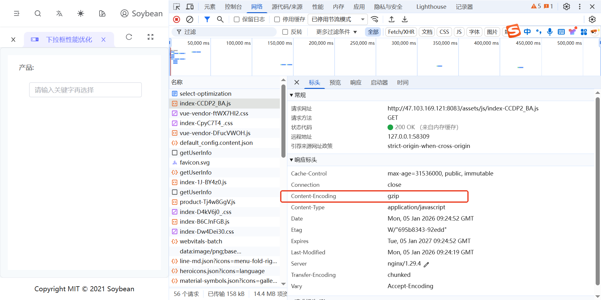
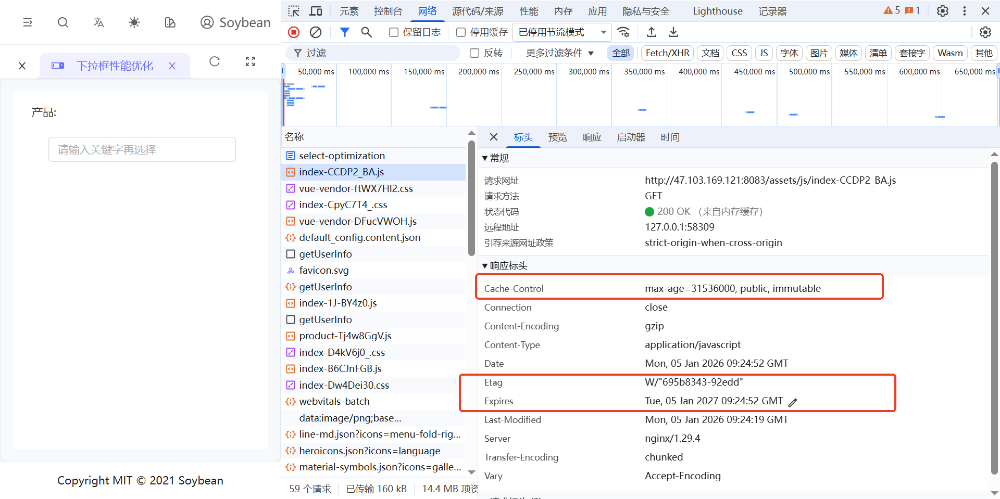

# Nginx 配置

## 概述

Nginx 作为高性能的 Web 服务器和反向代理服务器，合理配置可以显著提升网站性能和安全性。本文档介绍常用的 Nginx 配置优化策略，包括 Gzip 压缩、SPA 路由处理、缓存策略、安全头设置等。

## 1. Gzip 压缩

Gzip 压缩可以显著减少传输文件的大小，提升页面加载速度。



### Gzip 压缩效果

启用 Gzip 后，通常可以：

- HTML 文件压缩率：60-80%
- CSS/JS 文件压缩率：70-90%
- 显著减少带宽使用和加载时间

### brotli 压缩

br 压缩相对 Gzip 效果更好，但兼容性略差，同时 br 压缩需要下载 nginx-module-brotli，以及需要安装编译依赖

```
RUN apk add --no-cache \
 gcc \
 g++ \
 make \
 git \
 pcre-dev \
 zlib-dev \
 openssl-dev \
 nginx-dev

```

需要格外 100M 左右空间，以及下载依赖时网络稳定

## 2. History 路由 404 问题（SPA 路由处理）

单页应用（SPA）使用 History 模式路由时，刷新页面 404，直接访问子路由会出现 404 错误，需要配置 Nginx 将所有请求重定向到 `index.html`。

### 2.1 基础配置

```nginx
location / {
    try_files $uri $uri/ /index.html;
}
```

### 2.2 配置说明

- **try_files**: 按顺序尝试文件
  - `$uri`: 尝试访问请求的文件
  - `$uri/`: 尝试访问请求的目录
  - `/index.html`: 如果都不存在，返回 `index.html`（由前端路由处理）

### 2.3 完整示例（VitePress/Vue Router）

```nginx
server {
    listen 80;
    server_name localhost;
    root /usr/share/nginx/html;
    index index.html;

    # SPA 路由处理
    location / {
        try_files $uri $uri/ /index.html;
    }

    # 处理带扩展名的文件（如 .html, .js, .css）
    location ~* \.(html|js|css)$ {
        try_files $uri =404;
    }
}
```

## 3. 缓存策略

合理的缓存策略可以减少服务器负载，提升用户体验。

### 3.1 静态资源缓存



```nginx
# 静态资源长期缓存
location ~* \.(js|css|png|jpg|jpeg|gif|ico|svg|woff|woff2|ttf|eot)$ {
    expires 1y;
    add_header Cache-Control "public, immutable";
    access_log off;
}
```

### 3.2 配置说明

- **expires 1y**: 设置缓存过期时间为 1 年
- **Cache-Control "public, immutable"**:
  - `public`: 允许所有缓存（CDN、浏览器等）缓存
  - `immutable`: 告知浏览器文件不会改变，避免重新验证
- **access_log off**: 关闭访问日志（减少 I/O）

### 3.3 HTML 文件缓存策略

HTML 文件通常不应该长期缓存，以确保用户获取最新内容：

```nginx
# HTML 文件不缓存或短期缓存
location ~* \.html$ {
    expires -1;
    add_header Cache-Control "no-cache, no-store, must-revalidate";
    add_header Pragma "no-cache";
}
```

### 3.4 带版本号的资源缓存

对于带版本号或哈希的资源（如 `app.abc123.js`），可以长期缓存，以 vite 打包的项目为例，当内容发生变化 hash 值会重新计算， hash 值发生变化会自动请求新文件：

```nginx
# 带哈希的资源长期缓存
location ~* \.[a-f0-9]{8,}\.(js|css)$ {
    expires 1y;
    add_header Cache-Control "public, immutable";
}

# 普通资源短期缓存
location ~* \.(js|css)$ {
    expires 7d;
    add_header Cache-Control "public";
}
```

### 3.5 缓存控制头详解

```nginx
# 不缓存
add_header Cache-Control "no-store";

# 需要重新验证
add_header Cache-Control "no-cache";

# 公共缓存，可被 CDN 缓存
add_header Cache-Control "public";

# 私有缓存，只能被浏览器缓存
add_header Cache-Control "private";

# 最大缓存时间（秒）
add_header Cache-Control "max-age=31536000";
```

## 4. 安全头设置

安全头可以防止常见的 Web 攻击，提升网站安全性。

### 4.1 基础安全头

```nginx
# 防止点击劫持
add_header X-Frame-Options "SAMEORIGIN" always;

# 防止 MIME 类型嗅探
add_header X-Content-Type-Options "nosniff" always;

# 启用 XSS 保护
add_header X-XSS-Protection "1; mode=block" always;
```

### 4.2 完整安全头配置

```nginx
# 安全头配置
add_header X-Frame-Options "SAMEORIGIN" always;
add_header X-Content-Type-Options "nosniff" always;
add_header X-XSS-Protection "1; mode=block" always;

# 内容安全策略（CSP）- 根据实际需求调整
add_header Content-Security-Policy "default-src 'self'; script-src 'self' 'unsafe-inline' 'unsafe-eval'; style-src 'self' 'unsafe-inline';" always;

# 推荐使用 HTTPS（如果使用 HTTPS）
add_header Strict-Transport-Security "max-age=31536000; includeSubDomains" always;

# 引用策略
add_header Referrer-Policy "strict-origin-when-cross-origin" always;
```

### 4.3 安全头说明

- **X-Frame-Options**: 防止页面被嵌入到 iframe 中（防止点击劫持）
- **X-Content-Type-Options**: 防止浏览器 MIME 类型嗅探
- **X-XSS-Protection**: 启用浏览器内置的 XSS 过滤器
- **Content-Security-Policy**: 内容安全策略，限制资源加载来源
- **Strict-Transport-Security**: 强制使用 HTTPS（HSTS）

## 总结

Nginx 配置优化要点：

1. **Gzip 压缩**: 减少传输文件大小，提升加载速度
2. **SPA 路由处理**: 使用 `try_files` 处理 History 模式路由
3. **缓存策略**: 静态资源长期缓存，HTML 不缓存或短期缓存
4. **安全头**: 设置必要的安全响应头，防止常见攻击
5. **性能优化**: 合理配置工作进程、连接数、文件缓存等

通过合理配置这些选项，可以显著提升网站的性能、安全性和用户体验。
