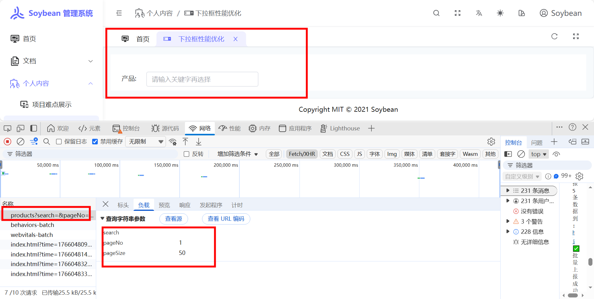
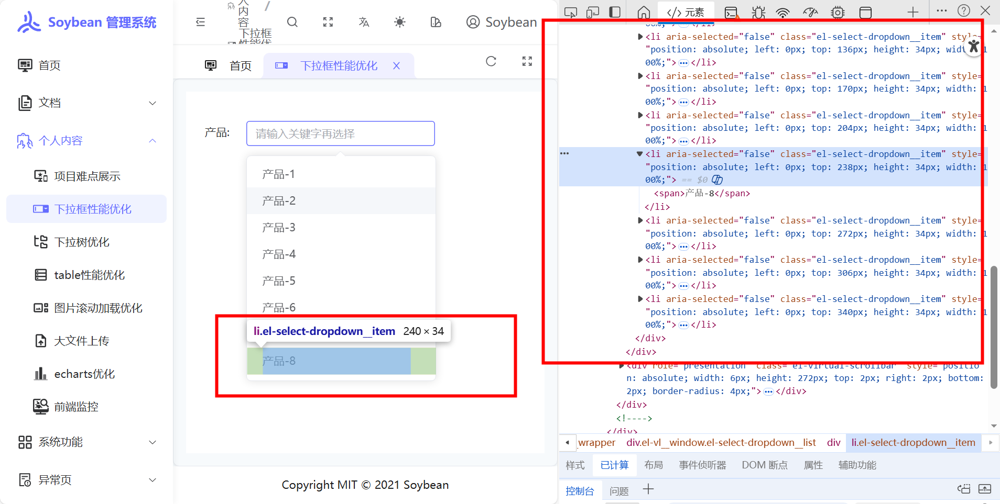
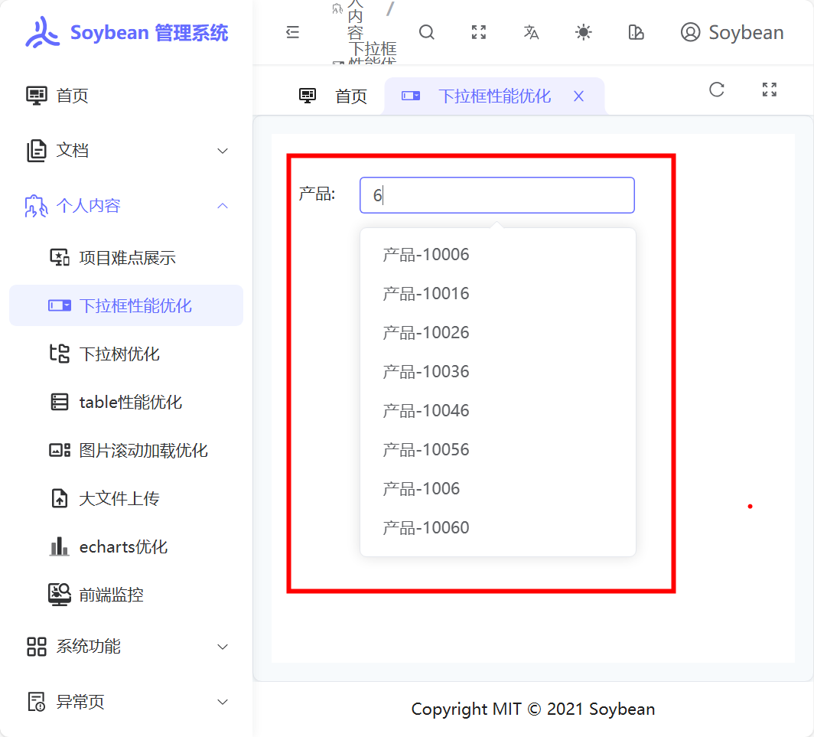

# 下拉框性能优化

http://47.103.169.121:8083/personal-content/select-optimization

## 场景

当下拉框接口数据几万条导致：

1. 几万条数据接口请求慢，导致页面卡死的性能问题
2. 下拉列表一次性渲染上万条数据，导致页面卡死的性能问题

## 解决方案

封装一个自定义的滚动加载下拉框:

1.滚动加载，一次请求 50 条数据

2.按需渲染，下拉框按需渲染只渲染下拉框窗口的数据

## 效果展示

### 滚动加载

### 按需渲染

### 远程搜索+防抖功能，搜索的结果也是滚动加载，按需渲染

