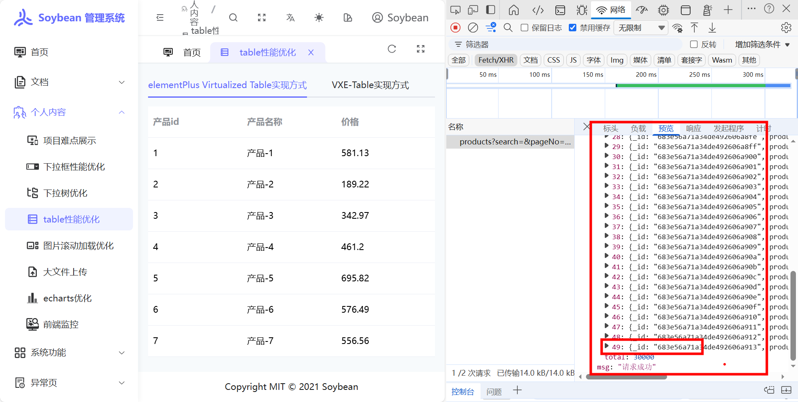
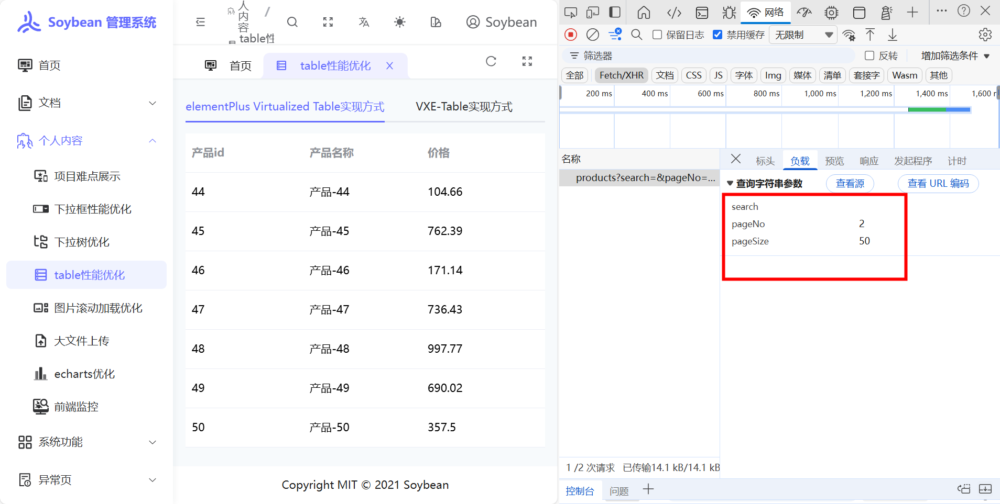
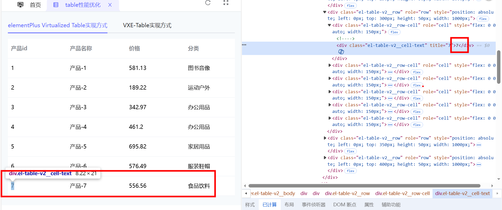
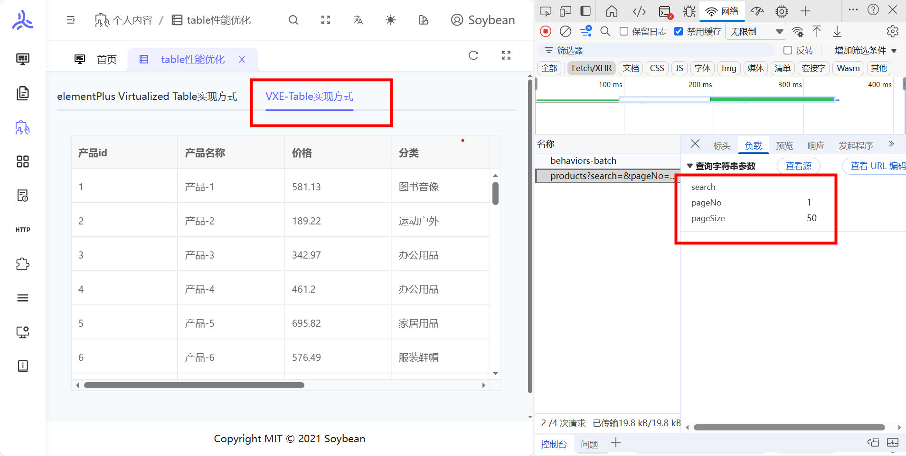
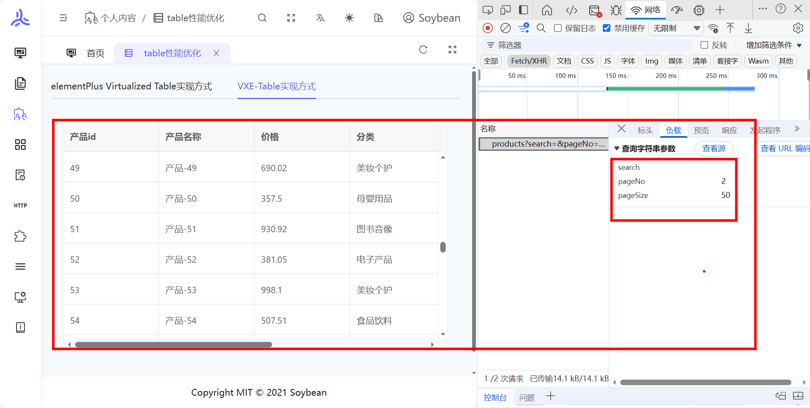
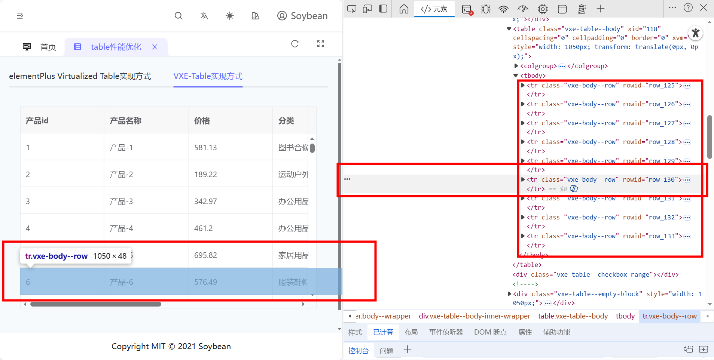

# table 性能优化

http://47.103.169.121:8083/personal-content/table-optimization

## 场景

当 table 数据几万条导致：

1. 几万条数据接口请求慢，导致页面卡死的性能问题
2. table 一次性渲染上万条数据，导致页面卡死的性能问题

## 解决方案

封装一个自定义的滚动加载 table:

1.滚动加载，一次请求 50 条数据

2.按需渲染，table 按需渲染只渲染 table 窗口的数据

## 基于 elementPlus Virtualized Table 实现方式效果展示

### 滚动加载

#### 滚到底部，加载更多数据

### 按需渲染

## 基于 VXE-Table 实现方式实现方式效果展示

### 滚动加载

#### 滚到底部，加载更多数据

### 按需渲染

