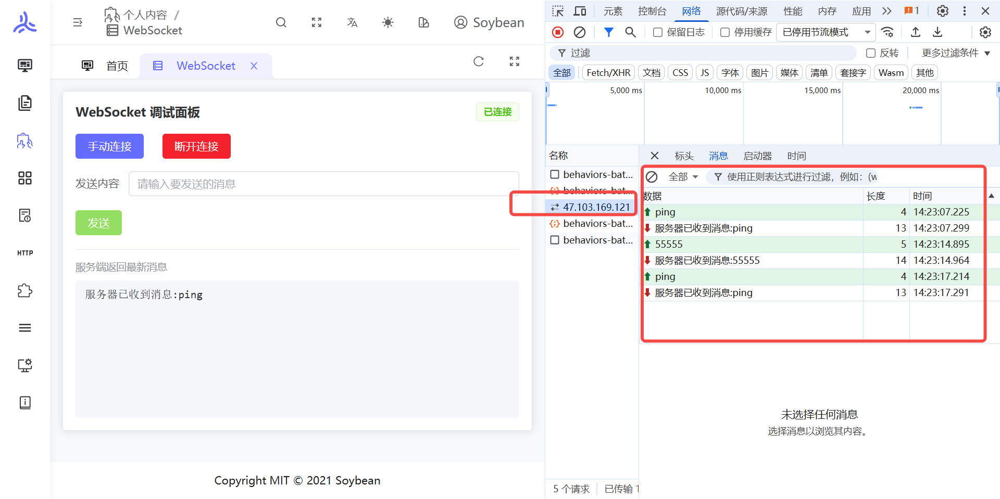

# WebSocket

<br>
<br>

在线地址: http://47.103.169.121:8083/personal-content/websocket

## 概述

**WebSocket** 是一种在单个 TCP 连接上提供**全双工**通信的网络协议。客户端与服务器建立连接后，双方可以随时主动向对方发送数据，而不必像传统 HTTP 那样每次请求都重新握手。

在 **HTTP/1.1** 中，请求由客户端发起，服务器响应后连接通常即结束（或在一段时间内复用）；适合「一问一答」的页面与接口。**WebSocket** 则适合需要**持续、低延迟、双向**交互的场景，例如即时消息、协作编辑、实时大屏、股票行情、游戏状态同步等。



## 与 HTTP 的常见对比

| 维度     | HTTP（典型用法）            | WebSocket                |
| -------- | --------------------------- | ------------------------ |
| 通信方向 | 以客户端请求为主            | 建立后双向对等           |
| 连接方式 | 短连接或有限长连接          | 长连接，保持打开         |
| 实时性   | 轮询/长轮询可模拟，开销较大 | 服务端可主动推送，延迟低 |
| 适用场景 | 页面、REST API、资源加载    | 实时推送、双向流式交互   |

## 建立过程（简要）

1. 客户端通过 **HTTP 升级请求**（带 `Upgrade: websocket` 等头）向服务器发起握手。
2. 服务器若支持 WebSocket，返回 **101 Switching Protocols**，之后该连接从 HTTP 语义切换为 WebSocket 帧协议。
3. 后续数据以 **WebSocket 帧** 形式传输，可传文本或二进制。

浏览器侧通常使用原生 **`WebSocket`** API，例如：

```js
const ws = new WebSocket("wss://example.com/socket");

ws.onopen = () => {
  ws.send(JSON.stringify({ type: "hello" }));
};

ws.onmessage = (event) => {
  console.log("收到:", event.data);
};

ws.onerror = (err) => {
  console.error(err);
};

ws.onclose = () => {
  console.log("连接已关闭");
};
```

生产环境中 URL 一般使用 **`wss://`**（TLS 加密），与 **`https://`** 站点同源策略、安全策略一致。

## 使用注意

- **断线重连**：网络抖动、代理超时会导致连接断开，业务上常配合心跳与指数退避重连。

## 小结

WebSocket 用**一条长连接**解决「服务端主动推送」和「双向实时通信」需求，是前端实时类功能的常见基础设施；与 HTTP 互补：静态资源与常规 API 仍多用 HTTP，实时通道用 WebSocket（或同类技术如 SSE，适用于单向推送场景）。
